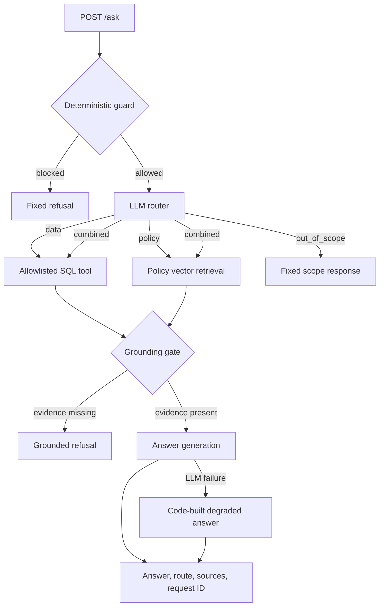

# Kartly Hybrid Order Support Assistant

Kartly is a FastAPI backend that answers customer questions using customer-scoped order data, store policy documents, or both. It combines fixed read-only SQL tools with vector retrieval and a grounding gate so unsupported questions can be refused instead of answered from model memory.

**Demo video:** [Google Drive](https://drive.google.com/file/d/10UlKy6M6LuNBasTzFbd6ENHWxAGG9l1a/view?usp=sharing)

## Highlights

| Area | Result |
|---|---|
| Labelled evaluation set | 42 cases |
| Hybrid pipeline | 40/42 passes |
| Vector-only baseline | 29/42 passes |
| LLM-only baseline | 23/42 passes |
| Test suite | 278 pytest cases |
| Policy corpus | 9 documents / 30 expected chunks |
| Order access | Customer-scoped, parameterized, read-only SQL |
| Policy updates | Content-hash versioned ingestion and replacement |

## Quick Start

Prerequisites: Docker with Docker Compose and a Groq API key.

```bash
git clone https://github.com/AashishBedi/kartly-hybrid-order-assistant.git
cd kartly-hybrid-order-assistant
cp .env.example .env
```

On PowerShell, use `Copy-Item .env.example .env` instead of `cp`.

Set the following value in `.env`:

```dotenv
GROQ_API_KEY=<your Groq API key>
```

Build and start the service:

```bash
docker compose up --build -d
```

The first Docker build needs internet access to install dependencies and download the embedding model. The model is included in the image and configured for offline use at runtime.

```bash
curl http://localhost:8000/health
docker compose exec api pytest -q
```

The API is available at `http://localhost:8000`; Swagger documentation is at `http://localhost:8000/docs`.

## Example Request

The seeded order `#131` belongs to customer `13`.

```bash
curl -X POST http://localhost:8000/ask \
  -H "Content-Type: application/json" \
  -d '{"customer_id":13,"question":"What is the status of order #131?"}'
```

Abbreviated response:

```json
{
  "answer": "...",
  "route": "data",
  "blocked": false,
  "grounded": true,
  "degraded": false,
  "sources": {
    "sql": [{"tool": "get_order", "params": [131, 13]}],
    "chunks": []
  },
  "request_id": "<uuid>"
}
```

[`QUERIES.md`](QUERIES.md) contains 30 additional manual test prompts covering data, policy, combined, out-of-scope, adversarial, and unsupported questions. They are prompt examples, not an implemented `Ask-Kartly` CLI; most order examples assume `customer_id=13`.


[`Prompts.docx`](Prompts.docx) contains all the prompts used while planning, building and testing Kartly.

## Architecture



The guard runs before any model call. The router selects `data`, `policy`, `combined`, or `out_of_scope`; data questions use fixed SQL tools, policy questions use vector retrieval, and combined questions require both. The grounding gate prevents answer generation when required evidence is missing.

| Component | Implementation |
|---|---|
| Router | Groq `openai/gpt-oss-20b`, with keyword fallback |
| Answer model | Groq `openai/gpt-oss-120b` |
| Embeddings | `sentence-transformers/all-MiniLM-L6-v2` |
| Vector store | Persistent ChromaDB using cosine distance |
| Order database | SQLite opened read-only by request-serving code |

SQL is selected through deterministic tool planning: an explicit order number uses `get_order`, count wording uses `count_orders_by_status`, and other order questions use `list_orders`. Return windows and warranty dates are calculated in Python before answer generation.

## API Reference

| Method | Path | Purpose | Important input | Important output |
|---|---|---|---|---|
| `POST` | `/ask` | Answer an order or policy question | JSON `customer_id`, `question` | Answer, route, flags, sources, request ID |
| `POST` | `/documents` | Queue policy ingestion | Multipart `.md`/`.txt`; optional `doc_id` | HTTP 202 with job ID, document ID, status |
| `GET` | `/jobs/{job_id}` | Read ingestion-job state | Job ID | Status, result/error, timestamps |
| `GET` | `/health` | Process liveness | None | `{"status":"ok"}` |

`/health` is a liveness check only. It does not verify SQLite, ChromaDB, the embedding model, or Groq connectivity. FastAPI exposes Swagger at `/docs`.

Uploads must be non-empty UTF-8 `.md` or `.txt` files and may be at most 200,000 bytes. Job states are `queued`, `running`, `succeeded`, and `failed`.

## Safety & Grounding

- The LLM never generates or executes SQL.
- The data layer exposes only `get_order`, `list_orders`, and `count_orders_by_status`.
- Queries are fixed and parameterized, and every order query includes the submitted `customer_id`.
- Request-serving code opens SQLite through `mode=ro`.
- A SQL guard requires `SELECT`, rejects semicolons, and rejects write-related keywords.
- A deterministic pre-LLM guard blocks recognized SQL/write attempts, prompt injection, bulk PII requests, and requests for other customers' data.
- An order ID not owned by the submitted customer ID looks identical to a nonexistent order.
- Missing order or policy evidence produces a fixed refusal without calling the answer model.
- Grounded responses return SQL query metadata and/or policy chunk IDs.

The API does **not** authenticate customers. `customer_id` comes from the `/ask` request body and is not bound to a verified session or token. The data layer scopes results to that submitted ID, but a caller who supplies another valid customer ID is not prevented from impersonating it.

The PII guard is an English pattern-based safeguard, not comprehensive data-loss prevention. Fixed order tools do not select customer names, emails, phone numbers, or addresses.

`/documents` and `/jobs/{job_id}` are also unauthenticated. Production use would require administrative authorization for policy mutation and job inspection.

## Policy RAG & Async Ingestion

The default corpus contains **9 policy documents** and produces **30 expected chunks** using a 600-character chunk size and 80-character overlap.

Retrieval embeds the question, fetches the four nearest ChromaDB chunks, and retains candidates with cosine distance `<= 0.62`. Order references are removed from hybrid questions before policy retrieval.

Each version is the first 12 hexadecimal characters of SHA-256 over whitespace-normalized content. Chunk IDs use:

```text
<doc_id>:<content-hash-version>:<zero-based-chunk-index>
```

Ingestion results are:

- `unchanged`: identical hash; embedding is skipped.
- `ingested`: the document did not previously exist.
- `replaced`: changed content replaced the previous version.

New chunks are added before old-version chunks are removed. This preserves the previous version if chunking or embedding fails. A process-local per-document lock serializes uploads for the same document within one API process.

Ingestion uses an in-process FastAPI background task and a separate SQLite job database. Replacement is not a fully transactional multi-version operation: a failure after upsert but before old-version deletion could leave multiple versions stored.

## Evaluation

The checked-in set contains **42 labelled cases**: 8 data, 8 policy, 9 combined, 5 out-of-scope, 6 unanswerable, and 6 adversarial questions.

- **Hybrid:** full guard, router, SQL/vector retrieval, grounding, and answer pipeline.
- **Vector-only:** top-four policy retrieval with no SQL, router, deterministic guard, or relevance threshold, followed by one answer-model call.
- **LLM-only:** one answer-model call with a generic support prompt and no retrieval or customer data.

### Official Run 5 results — all 42 cases

| Category | Hybrid passes | Hybrid unsupported | Vector-only passes | Vector-only unsupported | LLM-only passes | LLM-only unsupported |
|---|---:|---:|---:|---:|---:|---:|
| Overall | **40/42** | **1/42** | **29/42** | **2/42** | **23/42** | **22/42** |
| Data | 8/8 | 0/8 | 1/8 | 0/8 | 2/8 | 3/8 |
| Policy | 8/8 | 0/8 | 8/8 | 0/8 | 5/8 | 5/8 |
| Combined | 8/9 | 0/9 | 5/9 | 0/9 | 7/9 | 6/9 |
| Out of scope | 5/5 | 0/5 | 4/5 | 1/5 | 2/5 | 2/5 |
| Unanswerable | 5/6 | 1/6 | 5/6 | 1/6 | 2/6 | 5/6 |
| Adversarial | 6/6 | 0/6 | 6/6 | 0/6 | 5/6 | 1/6 |

The rule-based correctness judge requires every labelled check for a case to pass and the system to complete without error. Checks cover order values, policy numbers, return decisions, refusal wording, and required or forbidden text.

The unsupported-answer metric flags cases containing selected concrete claims—such as order IDs, statuses, dates, amounts, day counts, percentages, or emails—that cannot be matched to allowed question, check, SQL, or retrieved-policy evidence. For refusal categories, it can also flag a non-refusal declarative answer. The detector is deliberately narrow; an unflagged answer is not proof that every sentence is supported.

### Secondary adjusted analysis

The adjusted summary excludes `U05`, which was labelled unanswerable despite policy coverage, and `C07`, whose check requires the warranty length although the question asks for an end date.

| System | Adjusted passes | Adjusted unsupported |
|---|---:|---:|
| Hybrid | 40/40 | 0/40 |
| Vector-only | 28/40 | 1/40 |
| LLM-only | 22/40 | 20/40 |

This view is secondary. The official headline remains the complete 42-case result.

Limitations: the set is small and self-authored, the judge uses rules and string matching, model outputs can vary, and unsupported detection is narrow. The two exclusions were identified after inspecting failures.

Frozen raw outputs, judged JSON, and review CSV files are checked into `eval/results/`. Running a new evaluation requires live model calls.

## Testing

The suite contains **278 pytest cases**. Fakes are used for LLM and embedding behavior where appropriate, so the normal suite does not require a Groq key or network access.

| Group | Coverage |
|---|---|
| Routing and security | Routes, guards, fallbacks, malicious and benign phrasing |
| Access control and data tools | Customer scoping, argument validation, SQL safety, read-only writes |
| RAG and grounding | Chunking, vector ordering, relevance threshold, evidence combinations |
| Ingestion | First upload, unchanged content, replacement, failures, job lifecycle |
| LLM reliability | Timeouts, retries, `Retry-After`, malformed/blank responses, cache, cost |
| API behavior | Validation, routes, refusals, degraded responses, uploads, health |
| Evaluation tooling | Cases, baselines, runner, judge, resume, redaction, exclusions |

```bash
docker compose exec api pytest -q
```

No pytest execution report is checked into the repository.

## Reliability & Observability

- `.env.example` configures a 30-second LLM timeout and two retries after the initial attempt.
- Timeouts, transport failures, HTTP 429, and HTTP 5xx are retried with exponential backoff.
- `Retry-After` is supported for HTTP 429 and capped at five seconds; ordinary HTTP 4xx responses are not retried.
- Router errors or invalid router JSON use a keyword fallback.
- Answer-model failures return a code-built grounded answer with `degraded: true`.
- With no API key, the service still starts and uses the router/answer failure paths where applicable.
- Embedder and ChromaDB warm-up failures are logged without preventing startup.

Each `/ask` pipeline execution gets a UUID and emits JSON metrics containing total pipeline latency and each LLM call's model, stage, latency, attempts, finish reason, cache status, tokens, and estimated cost. These custom metrics do not cover every endpoint.

The evaluation-only exact-request cache is enabled with `EVAL_CACHE=1` and disabled by `.env.example`. There is no production semantic or answer cache.

Database, vector-store, and embedder failures during `/ask` do not have an equivalent degraded path. Ingestion failures become failed jobs and are not retried automatically.

## Seed Data

| Table | Rows |
|---|---:|
| `customers` | 25 |
| `products` | 40 |
| `orders` | 280 |
| `order_items` | 715 |

The seed uses `random.seed(42)`. Ownership, products, and statuses are deterministic; order and delivery dates are relative to the seed date.

Docker Compose seeds only when `data/kartly.db` is absent, then ingests all policies on every startup. Unchanged policies are skipped by content hash.

## Project Structure

| Path | Responsibility |
|---|---|
| `app/api/` | HTTP endpoints and validation |
| `app/routing/` | Guard, LLM router, keyword fallback |
| `app/data/`, `app/db/` | Query tools, access checks, SQLite |
| `app/rag/` | Chunking, embeddings, ChromaDB, ingestion |
| `app/pipeline/` | Evidence, grounding, answer orchestration |
| `app/llm/` | Groq client, retries, evaluation cache |
| `app/jobs/` | SQLite-backed job state |
| `scripts/` | Seed, ingestion, live-check, demo utilities |
| `policies/` | Nine default documents |
| `tests/` | Unit and API tests |
| `eval/` | Cases, baselines, runner, judge, frozen results |

## Design Decisions & Trade-offs

- **Fixed tools instead of text-to-SQL:** the model cannot widen a query, but new data questions may require a new tool.
- **Security before the LLM:** deterministic guards block recognized unsafe requests without model cost, but their English patterns are limited.
- **Dates computed in code:** return and warranty arithmetic is deterministic, but policy changes must remain synchronized with configuration.
- **Grounding threshold:** retrieval can fail closed, but one threshold can reject borderline evidence or admit related yet insufficient evidence.
- **Versioned replacement:** add-before-delete preserves availability during embedding failure, but is not fully transactional.
- **In-process jobs:** simple deployment, but tasks are not durable across restarts and locks do not coordinate multiple processes.

## Known Limitations

- No authentication; `/ask` trusts request-body `customer_id`.
- Policy upload and job lookup are unauthenticated.
- Small self-authored evaluation with a rule/string-based judge.
- Keyword fallback routing and tool planning can misclassify unusual wording.
- Guard and fallback rules are English-only and pattern-based.
- Background tasks and per-document locks are process-local.
- SQLite and local ChromaDB are not horizontally scalable.
- Policy replacement is not fully transactional.
- Non-LLM dependency failures have no degraded-answer fallback.
- One relevance threshold is used for all policy questions.

## AI Tool Disclosure & Assumptions

### AI tool disclosure

- OpenAI Codex with GPT-5.6 Sol using High reasoning was the primary coding agent used locally.
- Development followed a prompt-by-prompt workflow covering the backend, tests, Docker setup, evaluation tooling, and documentation.
- The author reviewed generated changes and inspected tests, the Docker workflow, and evaluation failures before making the final design and evaluation decisions.

### Project assumptions

- Kartly and all seeded customer/order data are fictional.
- The return window is 30 calendar days from delivery, counted inclusively.
- Warranty end dates are the recorded delivery date plus each product's `warranty_months`.
- Policy documents were written for this project.
- Seeded dates are relative to the day `scripts.seed` runs.
- Customer identity is accepted in the request because the assignment defines `/ask` with a customer ID; production must derive it from authenticated identity.
- Logged costs are estimates from configurable token prices, not billing records.
